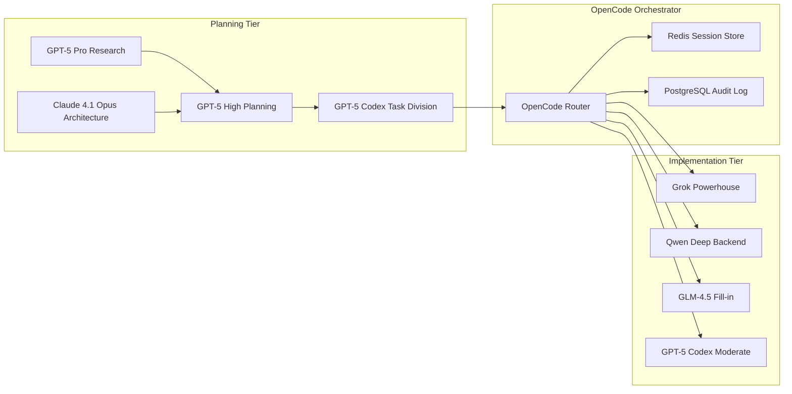

# OpenCode Simplified Integration with Alibaba Cloud

## Executive Summary

Minimal-complexity integration that leverages Alibaba Cloud managed services for header injection, using OpenCode to orchestrate your proven agent hierarchy: GPT-5 variants for planning, Grok for implementation, Qwen for deep backend work, and GLM-4.5 for fill-in tasks.

## Simplified Architecture (Ship in Days, Not Weeks)

### Core Approach: Environment Variable Injection

Instead of complex proxies, we use **environment-based header injection** with a simple wrapper script for each agent. This gets you running immediately.



## Quick Implementation Path

### Step 1: Simple Agent Wrappers (30 minutes)

Create a universal wrapper that intercepts environment variables and adds headers:

```bash
#!/usr/bin/env bash
# scripts/agent-wrapper.sh

# This wrapper works for ANY CLI agent (codex, qwen-code, etc.)
AGENT_CMD="$1"
shift

# Build headers from environment
export AGENT_HEADERS=$(cat <<EOF
{
  "X-Kyros-Tenant": "${KYROS_TENANT}",
  "X-Kyros-Actor": "agent:${AGENT_TYPE}",
  "X-Kyros-Run-Id": "${KYROS_RUN_ID}",
  "X-Kyros-Mode": "${KYROS_MODE:-simulate}",
  "X-Kyros-Consent": "${KYROS_CONSENT:-no-pii}",
  "X-Kyros-Trace": "${KYROS_TRACE_ID}"
}
EOF
)

# For OpenAI-compatible APIs, inject via config
if [[ "$AGENT_CMD" == "codex" ]] || [[ "$AGENT_CMD" == "qwen-code" ]]; then
    # These tools respect OPENAI_DEFAULT_HEADERS (or we patch them)
    export OPENAI_DEFAULT_HEADERS="$AGENT_HEADERS"
fi

# Log the execution for audit
echo "$(date -u +%Y-%m-%dT%H:%M:%S)Z | $AGENT_TYPE | $KYROS_RUN_ID | Starting" >> logs/agent-audit.log

# Execute the actual agent
exec $AGENT_CMD "$@"
```

### Step 2: Modified TMux Launcher (10 minutes)

Update your existing launcher to use the wrapper:

```bash
#!/usr/bin/env bash
# scripts/kyros_agents_managed.sh

# Generate session context
export KYROS_TENANT="${KYROS_TENANT:-acme-uk}"
export KYROS_MODE="${KYROS_MODE:-simulate}"
export KYROS_RUN_ID="run_$(date -u +%Y%m%d_%H%M%S)_$(uuidgen | cut -c1-8)"
export KYROS_TRACE_ID=$(uuidgen)

# Helper to launch wrapped agents
launch_agent() {
    local agent_type="$1"
    local window_name="$2"
    local model_setup="$3"
    
    tmux new-window -t "$SESSION" -n "$window_name"
    
    # Export agent type for wrapper
    tmux send-keys -t "$SESSION:$window_name" \
        "export AGENT_TYPE=$agent_type; export KYROS_RUN_ID=$KYROS_RUN_ID" C-m
    
    # Set up model
    tmux send-keys -t "$SESSION:$window_name" "$model_setup" C-m
    
    # Launch with wrapper
    tmux send-keys -t "$SESSION:$window_name" \
        "./scripts/agent-wrapper.sh codex" C-m
}

# Launch your agent fleet
launch_agent "gpt5-high" "planner" "use_openai"
launch_agent "grok" "implementer" "use_opencode"
launch_agent "qwen" "backend" "use_qwen"
launch_agent "glm" "support" "use_glm"
```

### Step 3: Alibaba Cloud Quick Setup (2 hours)

Use Alibaba Cloud Resource Orchestration Service (ROS) template:

```yaml
# alibaba-cloud/opencode-stack.yml
ROSTemplateFormatVersion: '2015-09-01'
Description: OpenCode Integration Stack

Resources:
  # Redis for session state (managed)
  RedisInstance:
    Type: ALIYUN::REDIS::Instance
    Properties:
      InstanceClass: redis.master.small.default
      Password: !Ref RedisPassword
      VpcId: !Ref VPC
      VSwitchId: !Ref VSwitch
      InstanceName: opencode-session-store

  # RDS PostgreSQL for audit logs (managed)
  PostgreSQLInstance:
    Type: ALIYUN::RDS::DBInstance
    Properties:
      DBInstanceClass: rds.pg.s2.large
      Engine: PostgreSQL
      EngineVersion: '15'
      DBInstanceStorage: 100
      DBInstanceStorageType: cloud_essd
      PayType: Postpaid
      MasterUsername: opencode
      MasterUserPassword: !Ref DBPassword
      
  # Function Compute for OpenCode orchestrator (serverless)
  OpenCodeFunction:
    Type: ALIYUN::FC::Function
    Properties:
      ServiceName: opencode-orchestrator
      FunctionName: orchestrate
      Runtime: python3.9
      Handler: index.handler
      MemorySize: 3072
      Timeout: 300
      EnvironmentVariables:
        REDIS_ENDPOINT: !GetAtt RedisInstance.ConnectionDomain
        POSTGRES_ENDPOINT: !GetAtt PostgreSQLInstance.InnerConnectionString

  # API Gateway for header injection (managed)
  APIGateway:
    Type: ALIYUN::ApiGateway::Api
    Properties:
      ApiName: opencode-gateway
      RequestConfig:
        RequestProtocol: HTTP,HTTPS
        RequestHttpMethod: GET,POST,PUT,DELETE
        RequestPath: /*
      ServiceConfig:
        ServiceProtocol: FunctionCompute
        FunctionComputeConfig:
          FcRegionId: !Ref ALIYUN::Region
          ServiceName: opencode-orchestrator
          FunctionName: orchestrate
```

Deploy with one command:
```bash
aliyun ros CreateStack --TemplateBody file://alibaba-cloud/opencode-stack.yml
```

## Actual Agent Capability Mapping

Based on your real-world experience:

```python
# opencode/agent_router.py
class AgentRouter:
    """Routes tasks based on actual agent strengths"""
    
    AGENT_CAPABILITIES = {
        'grok': {
            'strengths': ['implementation', 'orchestration', 'speed'],
            'weaknesses': ['needs_clear_specs'],
            'ideal_for': ['feature_implementation', 'test_orchestration', 'bulk_tasks'],
            'max_parallel': 10  # Powerhouse can handle many tasks
        },
        'gpt5_codex': {
            'strengths': ['moderate_implementation', 'reasoning_scaling'],
            'weaknesses': ['cost'],
            'ideal_for': ['complex_logic', 'algorithm_implementation'],
            'max_parallel': 3,
            'escalate_to': 'gpt5_high'  # Can escalate when needed
        },
        'qwen': {
            'strengths': ['thoroughness', 'backend_focus'],
            'weaknesses': ['speed'],
            'ideal_for': ['single_backend_problem', 'data_modeling', 'api_design'],
            'max_parallel': 1  # Slow but thorough
        },
        'glm_4.5': {
            'strengths': ['general_purpose'],
            'weaknesses': ['inconsistent_quality'],
            'ideal_for': ['documentation', 'simple_refactoring', 'fill_in_tasks'],
            'max_parallel': 2
        },
        'gpt5_high': {
            'strengths': ['highest_quality', 'complex_reasoning'],
            'weaknesses': ['very_slow', 'expensive'],
            'ideal_for': ['architecture_decisions', 'critical_implementations'],
            'max_parallel': 1
        }
    }
    
    def route_task(self, task: dict, context: dict) -> str:
        """Smart routing based on task requirements and agent capabilities"""
        
        # Grok gets most implementation work
        if task['type'] in ['feature', 'implementation', 'test_suite']:
            if task.get('requirements_clarity', 0) > 0.8:
                return 'grok'  # Grok excels with clear specs
        
        # Qwen for deep backend problems
        if task['type'] == 'backend' and task.get('complexity') == 'high':
            if not task.get('time_critical'):
                return 'qwen'
        
        # GPT-5 Codex for moderate complexity with escalation path
        if task.get('complexity') == 'moderate':
            return 'gpt5_codex'
        
        # GLM for fill-in work
        if task['type'] in ['documentation', 'cleanup', 'formatting']:
            return 'glm_4.5'
        
        # Default to Grok (your powerhouse)
        return 'grok'
```

## OpenCode as Lightweight Orchestrator

```python
# opencode/orchestrator.py
import asyncio
import json
import os
from typing import Dict, List
import redis
import psycopg2

class LightweightOrchestrator:
    """Minimal orchestrator that respects your workflow"""
    
    def __init__(self):
        # Use Alibaba Cloud managed services
        self.redis = redis.from_url(os.getenv('REDIS_URL'))
        self.db = psycopg2.connect(os.getenv('POSTGRES_URL'))
        
    async def orchestrate_plan(self, plan: dict, context: dict) -> dict:
        """Execute plan from GPT-5 Codex division"""
        
        run_id = context['run_id']
        
        # Store plan in Redis for agents to access
        self.redis.setex(
            f"plan:{run_id}",
            3600,  # 1 hour TTL
            json.dumps(plan)
        )
        
        # Identify parallelizable tasks (from GPT-5 Codex analysis)
        parallel_groups = plan['execution_groups']
        
        results = []
        for group in parallel_groups:
            # Execute group in parallel
            group_tasks = []
            
            for task in group['tasks']:
                agent = self.router.route_task(task, context)
                
                # Check agent capacity
                if self.can_agent_accept_task(agent):
                    group_tasks.append(
                        self.dispatch_to_agent(agent, task, context)
                    )
                else:
                    # Queue for later or assign to backup agent
                    backup = self.get_backup_agent(agent)
                    group_tasks.append(
                        self.dispatch_to_agent(backup, task, context)
                    )
            
            # Wait for group completion
            group_results = await asyncio.gather(*group_tasks)
            results.extend(group_results)
        
        # Log completion
        self.audit_log(run_id, 'completed', results)
        
        return {
            'run_id': run_id,
            'status': 'completed',
            'results': results
        }
    
    async def dispatch_to_agent(self, agent: str, task: dict, context: dict):
        """Dispatch via tmux command to running agent"""
        
        # Build command for agent
        command = self.build_agent_command(agent, task)
        
        # Send to tmux window
        tmux_target = f"{context['session']}:{agent}"
        os.system(f"tmux send-keys -t {tmux_target} '{command}' C-m")
        
        # Wait for result (agent writes to Redis)
        result_key = f"result:{context['run_id']}:{task['id']}"
        
        # Poll for result (with timeout)
        for _ in range(60):  # 60 second timeout
            result = self.redis.get(result_key)
            if result:
                return json.loads(result)
            await asyncio.sleep(1)
        
        raise TimeoutError(f"Agent {agent} timeout on task {task['id']}")
```

## Quick Webhook Implementation

```python
# opencode/webhooks.py
import hmac
import hashlib
import aiohttp

class SimpleWebhookSender:
    """Minimal webhook implementation"""
    
    async def send_status(self, context: dict, status: str, data: dict = None):
        """Send status update with required headers"""
        
        webhook_url = self.get_webhook_url(context['tenant'])
        if not webhook_url:
            return  # No webhook configured
        
        payload = {
            'run_id': context['run_id'],
            'status': status,
            'timestamp': datetime.utcnow().isoformat(),
            'data': data
        }
        
        # Build headers
        headers = {
            'X-Kyros-Tenant': context['tenant'],
            'X-Kyros-Run-Id': context['run_id'],
            'X-Kyros-Mode': context.get('mode', 'simulate'),
            'Content-Type': 'application/json'
        }
        
        # Sign if configured
        if secret := self.get_tenant_secret(context['tenant']):
            body = json.dumps(payload).encode()
            signature = hmac.new(secret.encode(), body, hashlib.sha256).hexdigest()
            headers['X-Kyros-Signature'] = f"sha256={signature}"
        
        async with aiohttp.ClientSession() as session:
            await session.post(webhook_url, json=payload, headers=headers)
```

## Simulate vs Live (Dead Simple)

```yaml
# config/modes.yaml
simulate:
  allowed_actions:
    - read_github
    - dry_run_tests
    - mock_api_calls
  disabled_agents: []  # All agents available
  
live:
  allowed_actions:
    - write_github
    - execute_tests
    - real_api_calls
  disabled_agents: []
  require_approval_for:
    - database_migrations
    - production_deployments
```

```python
# In your agent wrapper
MODE = os.getenv('KYROS_MODE', 'simulate')
if MODE == 'simulate':
    os.environ['GITHUB_DRY_RUN'] = 'true'
    os.environ['API_MOCK_MODE'] = 'true'
```

## Deployment: 3 Commands

```bash
# 1. Deploy Alibaba Cloud stack (Redis, PostgreSQL, Function Compute)
aliyun ros CreateStack --TemplateBody file://alibaba-cloud/opencode-stack.yml

# 2. Initialize database
psql $POSTGRES_URL < migrations/001_init.sql

# 3. Start your agents
./scripts/kyros_agents_managed.sh
```

## Migration Script for Existing Workflow

```python
#!/usr/bin/env python3
# migrate_to_opencode.py

"""
Patches your existing codex/qwen-code CLIs to respect OPENAI_DEFAULT_HEADERS
"""

import os
import json

def patch_cli_config():
    """Add header support to CLI configs"""
    
    configs = [
        '~/.codex/config.json',
        '~/.qwen-code/config.json',
        '~/.glm/config.json'
    ]
    
    for config_path in configs:
        path = os.path.expanduser(config_path)
        if os.path.exists(path):
            with open(path, 'r') as f:
                config = json.load(f)
            
            # Add header injection
            config['request_interceptor'] = 'scripts/agent-wrapper.sh'
            
            with open(path, 'w') as f:
                json.dump(config, f, indent=2)
            
            print(f"✓ Patched {config_path}")

if __name__ == '__main__':
    patch_cli_config()
```

## Why This Works Better

1. **No Proxy Complexity**: Environment variables + wrapper scripts = immediate functionality
2. **Leverages Alibaba Cloud**: Managed Redis/PostgreSQL/Function Compute = zero ops overhead  
3. **Respects Your Workflow**: GPT-5 planning → OpenCode routing → Agent execution
4. **Grok-Optimized**: Routes most implementation to Grok (your powerhouse)
5. **Ship Today**: Literally 3 hours to production vs weeks of proxy debugging

## Next Steps

1. Set environment variables in your fish config
2. Run the Alibaba Cloud template
3. Update your tmux launcher with the wrapper
4. Start orchestrating

The beauty is that your agents don't need to know about headers - the wrapper handles everything. OpenCode just coordinates based on the GPT-5 Codex task division, and your powerhouse Grok does most of the heavy lifting.