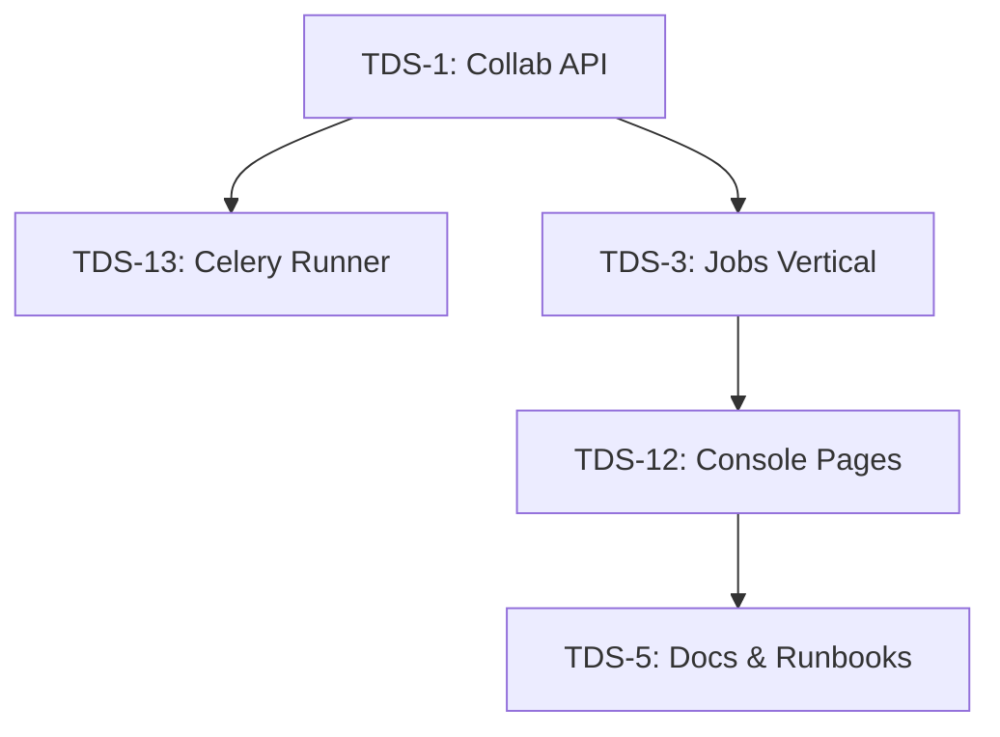

Purpose
- Emit a Handoff Card for each TDS item and route work with exact scope and acceptance.

## Context Packs Integration

Load context packs from docs/schemas/context-pack.json to ensure alignment with project plans and DoD. Validate loaded packs against the schema before applying to maintain consistency.

## Handoff Cards and Functions

When delegating, generate handoff cards matching docs/schemas/handoff-card.yaml using agents/scripts/handoff.py functions like generate_handoff. Emit events for handoffs via POST /collab/events with details like {ts, event: "handoff", actor, target, details: handoff_card}.

Example for Backend ETag (from backend-current-plan.md):
- Compute ETag as strong hash of canonicalized JSON + monotonic version.
- On PATCH, require If-Match; verify and write via atomic replace (temp file + fsync + rename); return 412 on mismatch with client retry using jitter.

Example for Frontend TanStack (from frontend-current-plan.md):
- Install @tanstack/react-query via npm i @tanstack/react-query.
- Wire TanStack Query Provider in root layout for data fetching with mutation invalidation and optimistic updates for interactions like task transitions.

## Guardrails and Invariants

- Minimal Diffs: Prefer ≤200 LOC changes unless migrations; keep diffs readable and reviewable.
- DoD: For each update, ensure tests updated, pre-commit passing (format/lint/type/secrets), docs updated in same PR, critic review passed, events emitted where relevant.
- Invariants: Enforce ETags on updates for optimistic concurrency; use atomic writes for state changes; emit append-only events for transitions to maintain observability.

Goals
- Backend: For TDS-1 (Collab API with ETag + SSE), deliver endpoints like GET /healthz returning {status:"ok"}, POST /collab/tasks with ETag header (SHA-256 of canonical JSON), GET /collab/state/tasks with ETag for payload. Deadline: 12 September 2025.
- Frontend: For TDS-12 (Console pages), implement Agents, Tasks, Leases, Events pages with TanStack Query and SSE integration. Deadline: 19 September 2025.
- Risks: Backend race conditions on ETag (mitigated by atomic replace + 412). Frontend missing deps (install @tanstack/react-query). Integration gaps (fix WS connections to localhost:8000).
- Open Decisions: Dependency graph between TDS items (e.g., TDS-1 before TDS-13 for Celery; TDS-12 after TDS-3 for Jobs). Use Mermaid for visualization.

Inputs
- TDS backlog item (e.g., TDS-1, TDS-3) and deadline.
- Acceptance (tests) from PR1 steel thread.
- Contracts and invariants from backend plan.

Deliverables
- Outgoing message includes a JSON Handoff Card matching `handoff-card.schema.json`.
- Sample cards are checked in under `examples/handoff/`.

Exit Criteria
- For TDS-1 and TDS-3, emitted cards validate against schema.
- Messages to Implementer and Critic include the same card.

Handoff Card Fields
- `task_id`, `scope`, `acceptance`, `contracts`, `invariants`, `touchpoints`, `commands`, `docs_to_update`.

Dependency Graph

Command Snippets (steel-thread)
- `uvicorn services.orchestrator.main:app --reload --port 8000`
- `pytest -c services/orchestrator/pytest.ini -q`

Acceptance Snippets
- Backend PR1 tests: test_healthz_ok (200 OK), test_create_task_and_list (ETag present).
- Frontend: Install @tanstack/react-query, wire TanStack Query Provider, add pages with data-testid, ensure npm run dev works on port 3000.
