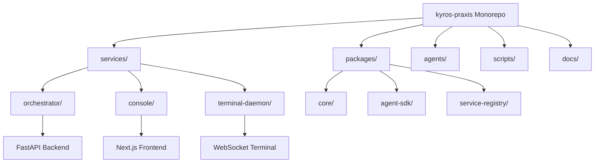
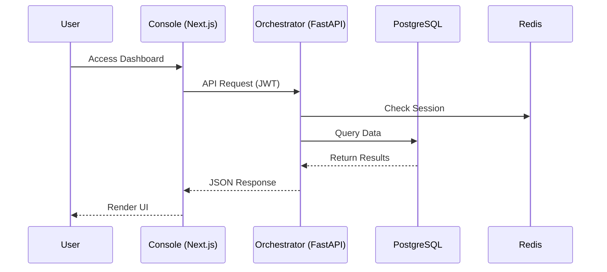
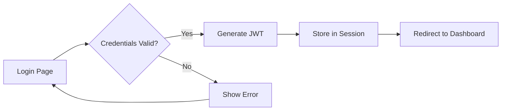
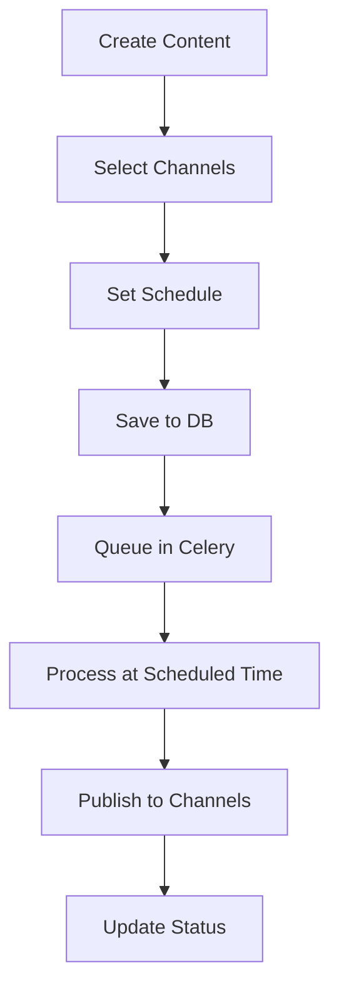
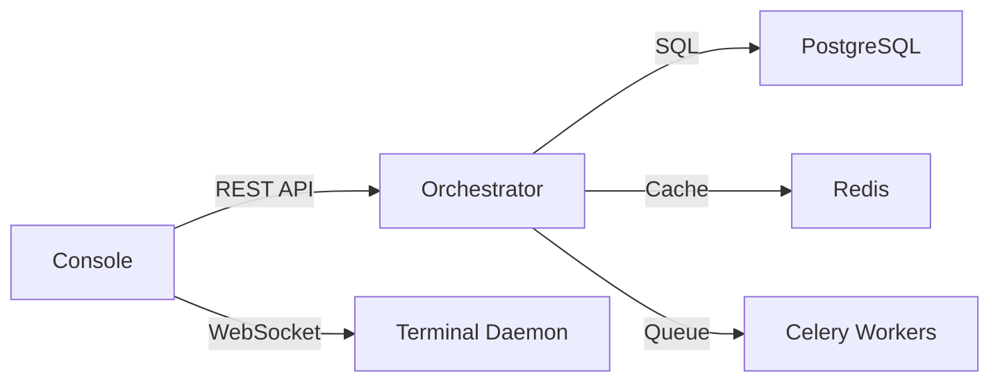
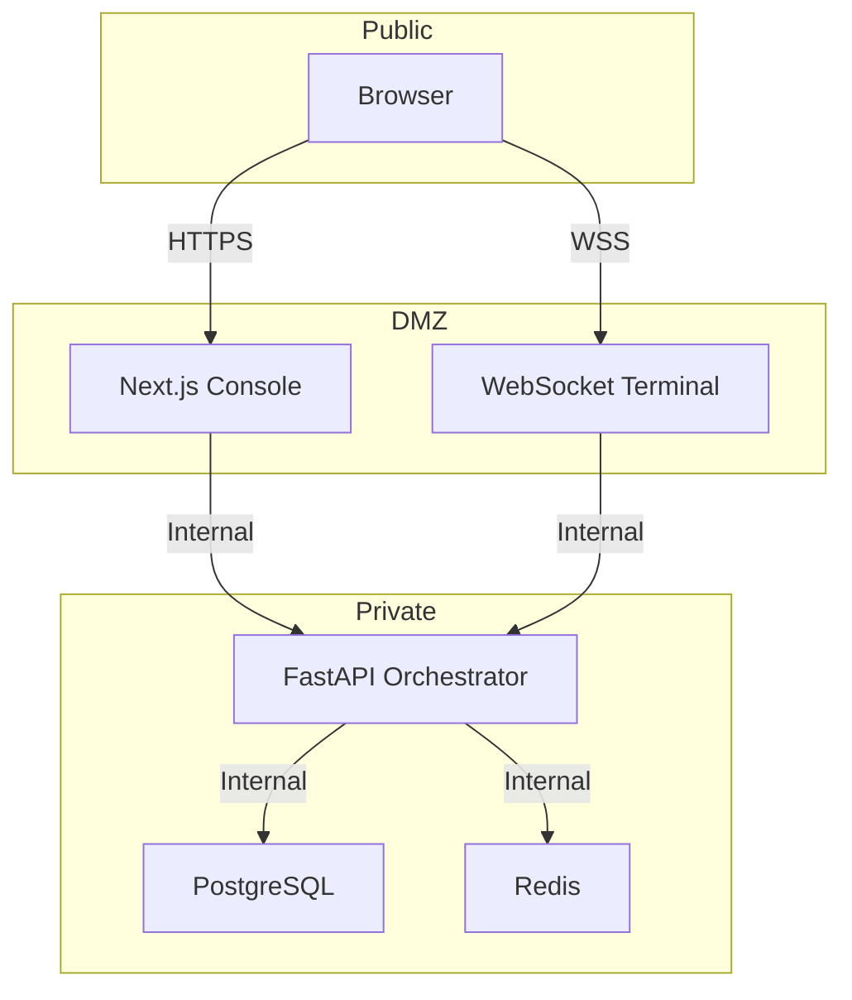

# Architecture Audit Phase 1: Code Cartography

**Date**: 2025-09-13  
**Auditor**: Agent Mode  
**Repository**: kyros-praxis

## Executive Summary

This document provides a comprehensive architectural map of the Kyros Praxis monorepo, including dependency graphs, service relationships, and critical user journey flows.

## Repository Structure

## Service Architecture

### Microservices Overview

| Service | Technology | Port | Purpose |
|---------|------------|------|---------|
| Orchestrator | FastAPI/Python | 8000 | REST API, auth, business logic |
| Console | Next.js/React | 3000/3001 | Web UI, user dashboard |
| Terminal Daemon | Node.js | 8080 | WebSocket terminal emulation |
| PostgreSQL | PostgreSQL 15 | 5432 | Primary database |
| Redis | Redis 7 | 6379 | Cache & session store |

### Data Flow Architecture

## Critical User Journeys

### 1. User Login Flow

**Components Involved**:
- Frontend: `/app/auth/login/page.tsx`
- Backend: `/services/orchestrator/auth.py`
- Database: `users` table
- Security: JWT with HS256, bcrypt password hashing

### 2. Content Scheduling Flow

**Components Involved**:
- Frontend: `/app/(dashboard)/content/` 
- Backend: `/services/orchestrator/routers/tasks.py`
- Queue: Celery with Redis broker
- Database: `tasks`, `events` tables

## Dependency Analysis

### Python Dependencies (Orchestrator)
- **Core**: FastAPI, SQLAlchemy, Pydantic
- **Auth**: passlib, python-jose, python-multipart
- **Database**: alembic, asyncpg, psycopg2
- **Testing**: pytest, httpx, respx

### JavaScript Dependencies (Console)
- **Core**: React 18, Next.js 14
- **UI**: Carbon Design System
- **State**: Zustand, TanStack Query
- **Auth**: NextAuth.js
- **Testing**: Jest, Playwright

## Inter-Service Communication

## Configuration Management

### Environment Variables
- **Database**: `DATABASE_URL`, `POSTGRES_*`
- **Auth**: `JWT_SECRET`, `NEXTAUTH_SECRET`
- **Services**: `BACKEND_CORS_ORIGINS`, `FRONTEND_HOST`
- **Redis**: `REDIS_URL`

### Configuration Files
- Docker: `docker-compose.yml`, `docker-compose.production.yml`
- Python: `pyproject.toml`, `requirements.txt`
- JavaScript: `package.json`, `tsconfig.json`
- CI/CD: `.github/workflows/*.yml`

## Security Boundaries

## Deployment Architecture

### Development
- Local Docker Compose
- SQLite for testing
- Hot reload enabled

### Production
- Docker containers
- PostgreSQL cluster
- Redis sentinel
- Nginx reverse proxy
- SSL/TLS termination

## Key Architectural Patterns

1. **Manifest-Driven Scaffolding**: Services defined in `manifest.yaml`
2. **Repository Pattern**: Database abstraction in orchestrator
3. **Dependency Injection**: FastAPI dependencies for auth/DB
4. **Event Sourcing**: Events logged to `events` table
5. **Token-Based Auth**: JWT for stateless authentication
6. **Async Operations**: Celery for background tasks

## Technical Debt Identified

- 10 TODO items across codebase (tracked in `docs/todo-burn-down.md`)
- No comprehensive E2E test suite
- Missing API documentation (OpenAPI/Swagger)
- Incomplete error handling in some endpoints
- No rate limiting implementation

## Recommendations

1. **Immediate**: Complete unit test coverage
2. **Short-term**: Implement rate limiting and API documentation
3. **Long-term**: Consider GraphQL for complex queries
4. **Strategic**: Evaluate Kubernetes for container orchestration

## Appendices

### A. File Structure Stats
- Total Files: ~500
- Lines of Code: ~25,000
- Test Coverage: ~60% (estimated)

### B. Database Schema
- Tables: 5 (users, tasks, jobs, events, alembic_version)
- Indexes: 8
- Foreign Keys: 3

### C. API Endpoints
- Public: 5 endpoints
- Authenticated: 15 endpoints
- Admin: 3 endpoints

---

*This document is part of a comprehensive architecture audit. See Phase 2 and Phase 3 for security analysis and refactoring roadmap.*