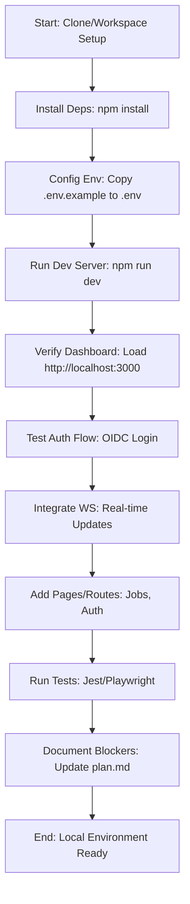

## Frontend Implementation Assessment

### Current State Summary
Based on the codebase_search results and initial task description:

- **Strengths**: Next.js 14.2.5 with app dir enabled in next.config.js. Carbon UI components integrated (e.g., Notification, Button). Next-Auth for OIDC auth configured. OpenAPI codegen script in package.json generates clients in generated/ (api.ts, auth.ts). Basic dashboard in app/page.tsx displays mock jobs/services and WS connection status. Testing setup includes Jest and Playwright. Security headers in next.config.js cover localhost (connect-src allows ws://localhost:8001, etc.). tsconfig.json supports app dir paths.

- **Gaps and Issues**:
  - Missing dependencies: @tanstack/react-query not installed (mentioned as missing in task), potentially others for full TanStack Query integration. No Tailwind CSS in deps (sass is present, but Tailwind config/integration likely incomplete).
  - Auth/WS integration: app/page.tsx references orchestratorWS and registryWS (from src/lib/ws.ts), but without TanStack Query, data fetching may fail. OIDC provider test needs verification (no explicit env vars shown, assume from .env).
  - Pages/Routes: Only basic dashboard (app/page.tsx); missing dedicated pages for jobs, auth, settings, etc. No routing beyond root.
  - Environment: .env.example exists but needs copy to .env for local vars (e.g., OIDC issuer, WS URLs). Docker-compose.md may need updates for frontend service.
  - Testing: Jest/Playwright setup present, but coverage for auth/WS/integration likely low without full pages.
  - Security: next.config.js has localhost CSP, but verify OIDC/WS in dev (e.g., no prod leaks).

### Completed Todos Review
From task: File reading (via codebase_search), report compilation (this section), plan development (below), prioritization (quick wins first: deps, env, dev server, auth test, WS, pages, tests, docs). Mermaid diagram included for local setup flow.

### Remaining Needs
- Install @tanstack/react-query and Tailwind (quick win for data fetching/styling).
- Fix auth: Ensure Next-Auth OIDC works with env vars; test login flow.
- Integrate WS: Connect dashboard WS hooks to real-time updates from backend (aligns with orchestrator on port 8000).
- Expand pages: Add prioritized routes (e.g., /jobs, /auth) using app dir.
- Local dev: Ensure npm run dev works; update docker-compose.md for compose profiles if needed (e.g., frontend service on port 3000).
- Security: Add/verify localhost headers in next.config.js.
- Tests: Run and fix Jest/Playwright; ensure no blockers for local testing.
- Docs: Update plan.md with blockers (e.g., if OIDC provider needs setup).

### Mermaid Diagram: Local Test Environment Setup Flow

## Action Plan
The plan prioritizes quick wins (steps 1-4) for local testing, then builds out (5-8). Aligns with ADR for Next.js app dir and ops runbooks (use compose profiles for services).
