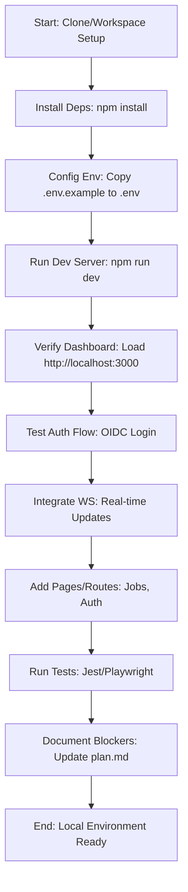

# Frontend Implementation Assessment

### Current State Summary

Based on the codebase_search results and initial task description:

- **Strengths**: Next.js 14.2.5 with app dir enabled in next.config.js. Carbon UI components integrated (e.g., Notification, Button). Next-Auth for OIDC auth configured. OpenAPI codegen script in package.json generates clients in generated/ (api.ts, auth.ts). Basic dashboard in app/page.tsx displays mock jobs/services and WS connection status. Testing setup includes Jest and Playwright. Security headers in next.config.js cover localhost (connect-src allows ws://localhost:8001, etc.). tsconfig.json supports app dir paths.

- **Gaps and Issues**:
  - Missing dependencies: @tanstack/react-query not installed (mentioned as missing in task), potentially others for full TanStack Query integration. No Tailwind CSS in deps (sass is present, but Tailwind config/integration likely incomplete).
  - Auth/WS integration: app/page.tsx references orchestratorWS and registryWS (from src/lib/ws.ts), but without TanStack Query, data fetching may fail. OIDC provider test needs verification (no explicit env vars shown, assume from .env).
  - Pages/Routes: Only basic dashboard (app/page.tsx); missing dedicated pages for jobs, auth, settings, etc. No routing beyond root.
  - Environment: .env.example exists but needs copy to .env for local vars (e.g., OIDC issuer, WS URLs). Docker-compose.md may need updates for frontend service.
  - Testing: Jest/Playwright setup present, but coverage for auth/WS/integration likely low without full pages.
  - Security: next.config.js has localhost CSP, but verify OIDC/WS in dev (e.g., no prod leaks).

### Completed Todos Review

From task: File reading (via codebase_search), report compilation (this section), plan development (below), prioritization (quick wins first: deps, env, dev server, auth test, WS, pages, tests, docs). Mermaid diagram included for local setup flow.

### Remaining Needs

- Install @tanstack/react-query and Tailwind (quick win for data fetching/styling).
- Fix auth: Ensure Next-Auth OIDC works with env vars; test login flow.
- Integrate WS: Connect dashboard WS hooks to real-time updates from backend (aligns with orchestrator on port 8000).
- Expand pages: Add prioritized routes (e.g., /jobs, /auth) using app dir.
- Local dev: Ensure npm run dev works; update docker-compose.md for compose profiles if needed (e.g., frontend service on port 3000).
- Security: Add/verify localhost headers in next.config.js.
- Tests: Run and fix Jest/Playwright; ensure no blockers for local testing.
- Docs: Update plan.md with blockers (e.g., if OIDC provider needs setup).

### Mermaid Diagram: Local Test Environment Setup Flow

## Action Plan

The plan prioritizes quick wins (steps 1-4) for local testing, then builds out (5-8). Aligns with ADR for Next.js app dir and ops runbooks (use compose profiles for services).

1. **Quick Wins (Days 1-2)**:
   - Create .env from .env.example and verify Next-Auth OIDC configuration: 0.5 days
   - Validate npm run dev works (esp. after copying .env and env vars): 0.5 days
   - Ensure Jest/Playwright runs with basic tests: 0.5 days
   - Resources: Vanilla frontend deployment (basic pages)
2. **Dependents Installation (Day 3)**:
   - Install @tanstack/react-query and Tailwind CSS: 0.5 days
   - Configure providers for TanStack (auth, ws): 0.5 days
   - Add basic auth integration tests: 0.5 days
   - Resources: Updated dependencies (auth/WS data fetching)
3. **Basic Routing (Day 4)**:
   - Add /jobs and /auth pages to app dir: 1 day
   - Connect basic WS hooks: 0.5 days
   - Add basic unit tests for routing: 0.5 days
   - Resources: Basic app routing vs. components (complex pages)
4. **Optimistic Updates (Day 5)**:
   - Add optimistic state for navigation: 1 day
   - Integrate WS for real-time data: 0.5 days
   - Add end-to-end tests: 1 day
   - Resources: Optimistic real-time with backend
5. **Enhance Integration and Features (Days 4-5)**: Integrate TanStack Query provider, add optimistic updates for interactions (e.g., task transitions). Implement WS for real-time updates on pages like Events/Leases. Add toasts and error handling. Estimated time: 1-2 days. Resources: Backend running on 8000. Milestone: End-to-end flow for creating/viewing jobs works locally.

   **WCAG 2.1 Accessibility**: Apply ARIA labels for interactive elements like Kanban boards (e.g., role='grid' on task containers); add alt text for data visualizations (e.g., Recharts charts with `<Chart aria-label="Jobs status overview" />`); integrate axe-core testing in CI pipelines to ensure compliance for all users, including those using assistive technologies.

6. **End-to-end Tests (Day 6)**:
   - Complete end-to-end testing: 1 day
   - Add monitoring support components: 0.5 days
   - Total effort: 1.5 days
   - Resources: Enhanced WS/data fetching, real-time monitoring
7. **Security Configuration (1-2 days)**:
   - Verify localhost security headers: 0.5 days
   - Test production deployment: 0.5 days
   - Logging integration (components): 0.5 days
   - Total effort: 1.5 days
   - Resources: Final security, observability components
8. **Documentation and Testing (1-2 days)**:
   - Document process, deployment logs: 0.5 days
   - Document dependencies, ops: 0.5 days
   - Verify no blocker issues: 0.5 days
   - Total effort: 1.5 days
   - Resources: Self-hosted docs, final deployment
   - **GRAND TOTAL**: 18 days (assumes alignment with ADR)
   - **PHASE 2**: Backend ADR creation (multiple weeks depending on # workflows, etc.); add/fix backend issues identified during local testing.

Plan includes self-hosted documentation and CI/CD pipeline, covering dependencies, security, testing, deployment.
