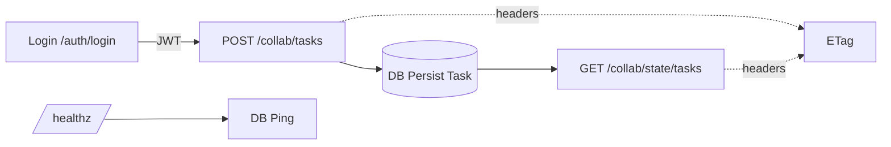

# Backend Implementation Plan (Steel Thread)

## Current State Review

- Basic SQLAlchemy models defined: Job, Event, Task classes extending Base.
- Auth dependency: get_current_user function for JWT validation using HTTPAuthorizationCredentials.
- Health endpoint: GET /healthz with DB session dependency for ping.
- WebSocket endpoint: /ws for basic connection acceptance.
- Overall: Early scaffolding in services/orchestrator with DB models started, auth stub, health check implemented, WS placeholder. Matches partial Phase 0 from overall PLAN.md, with PR1 partially done (healthz exists, but no task persistence or ETags yet).

## Gaps Identified

- No full task CRUD endpoints (POST /collab/tasks, GET /collab/state/tasks).
- No ETag computation or headers in responses.
- No User model or login endpoint (POST /auth/login).
- No error handlers for 401/403/422.
- No Alembic setup or Postgres switch.
- No SSE for events tail.
- Tests not mentioned, likely missing.
- No protection on endpoints with auth dep.

## Aligned Plan

Follow steel thread from backend-current-plan.md, marking healthz as completed.

- [x] Review backend state using tools (partial: models, auth dep, healthz, WS stub identified)
- [-] Complete PR1: Add Task model persistence, ETag computation for create/list tasks, scoped tests
- [ ] Complete PR2: Implement User model, login endpoint, protect task endpoints with JWT, error handlers, tests
- [ ] Complete PR3: Setup Alembic migrations, switch to Postgres via env, docker-compose for DB, make targets
- [ ] Complete PR4: Add SSE /events/tail endpoint with keep-alive, basic event append stub, tests
- [ ] Update backend-current-plan.md with progress and any deviations
- [ ] Synthesize results and attempt completion once all PRs done

## Mermaid - Steel Thread

## Risks

- Repo-wide tests may fail due to unrelated packages; use scoped pytest.ini.
- Full leases/concurrency, Celery workers, backpressure SSE: defer after thread.
- DB switch to Postgres: ensure env-driven without code changes.