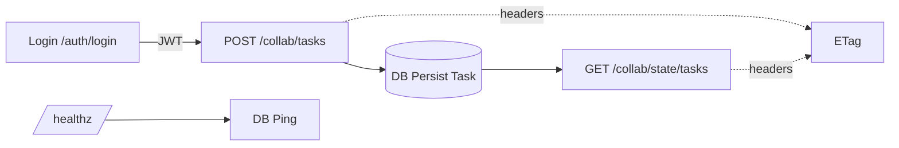

## Backend Implementation Plan (Steel Thread)

### Goals (Local, Fast, Verifiable)
- Deliver a runnable “steel thread”: Auth → Create Task → List Tasks → Health, all local, no external APIs.
- Strong ETag on reads/writes; foundation for conditional updates later.
- Tests cover the thread and run in isolation from other packages.

### Scope Guardrails
- Day 1: SQLite, sync SQLAlchemy. Day 2: switchable Postgres via Alembic + docker-compose.
- Defer Celery/Redis, leases, and complex SSE to after the thread is green.

### PR1 — Persistence, ETag, Health
- Models: `Task {id, title, description, version, created_at}` (SQLAlchemy sync, SQLite default).
- Endpoints:
  - `GET /healthz`: DB ping returns `{status:"ok"}`.
  - `POST /collab/tasks`: create; returns body `{id,title,description,version}` and header `ETag` (SHA‑256 of canonical JSON).
  - `GET /collab/state/tasks`: list items; returns header `ETag` for the full payload.
- Tests (scoped):
  - `test_healthz_ok`: 200.
  - `test_create_task_and_list`: create → list contains task; `ETag` present.
- Acceptance: curl flow works; tests pass with `pytest -c services/orchestrator/pytest.ini`.

### PR2 — Auth, Guards, Errors
- Deps: `python-jose[cryptography]`, `passlib[bcrypt]`.
- Add `User {id, email, password_hash}` and seed a dev user (env‑driven).
- Endpoints:
  - `POST /auth/login` (JSON): returns JWT.
  - Protect `POST /collab/tasks` with `Authorization: Bearer`.
- Error handling:
  - Central handlers for 401/403/404/422 → `{type, message, details?, request_id}`.
  - API key guard for selected routes (e.g., jobs) via `X-API-Key` header validated against `API_KEYS` env.
  - Rate limiting: SlowAPI limiter (default 60/min) keyed on API key with `REDIS_URL` storage (`memory://` default for local).
- Tests:
  - Unauthed create → 401.
  - Authed create → 200; invalid payload → 422 structured.
- Acceptance: end‑to‑end auth → create → list → health via curl.
  - Jobs endpoints require `X-API-Key`; tasks list stays public; task create requires JWT.

### PR3 — Postgres, Alembic, Compose
- Alembic: `alembic init`, `env.py` wired to settings, initial migration for `User`/`Task`.
- Compose: services `postgres` (and optional `redis`), app reads `DATABASE_URL`.
- Make targets: `db-upgrade`, `compose-up`, `compose-down`.
- Acceptance: `alembic upgrade head` on Postgres; tests pass under Postgres.

### PR4 (Optional) — SSE + Job Stub
- SSE: `/events/tail` minimal generator with keep‑alive; basic test that first chunk arrives.
- “Enqueue” stub: write an event row/file; no Celery yet.

### API Contracts (Current Thread)
- `GET /healthz` → `200 {status:"ok"}`
- `POST /auth/login` → `200 {access_token, token_type}`
- `POST /collab/tasks` (auth) → `200 {id,title,description,version}` + `ETag`
- `GET /collab/state/tasks` → `200 {kind:"tasks", items:[...]} + ETag`

### Configuration
- Env (with defaults):
  - `DATABASE_URL` (default `sqlite:///./orchestrator.db`)
  - `JWT_SECRET`, `JWT_EXPIRE_MINUTES=60`
  - `CORS_ORIGINS=http://localhost:3001`
- `.env.example` to document values.

### Dev Commands
- Run API (dev): `uvicorn services.orchestrator.main:app --reload --port 8000`
- Tests (scoped): `pytest -c services/orchestrator/pytest.ini -q`
- Compose (after PR3): `docker compose up -d postgres`
- Alembic (after PR3): `alembic upgrade head`

### Directory Touchpoints
- `services/orchestrator/main.py`: app, routes, session wiring.
- `services/orchestrator/models.py`: SQLAlchemy Base + models.
- `services/orchestrator/auth.py`: login route, JWT helpers, dependencies.
- `services/orchestrator/errors.py`: exception handlers.
- `services/orchestrator/tests/`: unit/contract tests for the thread.
- `alembic/`: env + versions (after PR3).

### Acceptance Checklist
- [ ] `GET /healthz` returns 200 on SQLite and Postgres.
- [ ] Create task requires JWT; unauthorized 401.
- [ ] ETag set on create and list responses.
- [ ] Tests green with scoped pytest; logs clean.
- [ ] Switch to Postgres via env without code changes.

### Mermaid — Steel Thread

### Risks & Deferrals
- Repo‑wide tests may fail due to unrelated packages; run orchestrator tests with its own `pytest.ini`.
- Full leases/concurrency, Celery workers, backpressure SSE: schedule after the thread.
